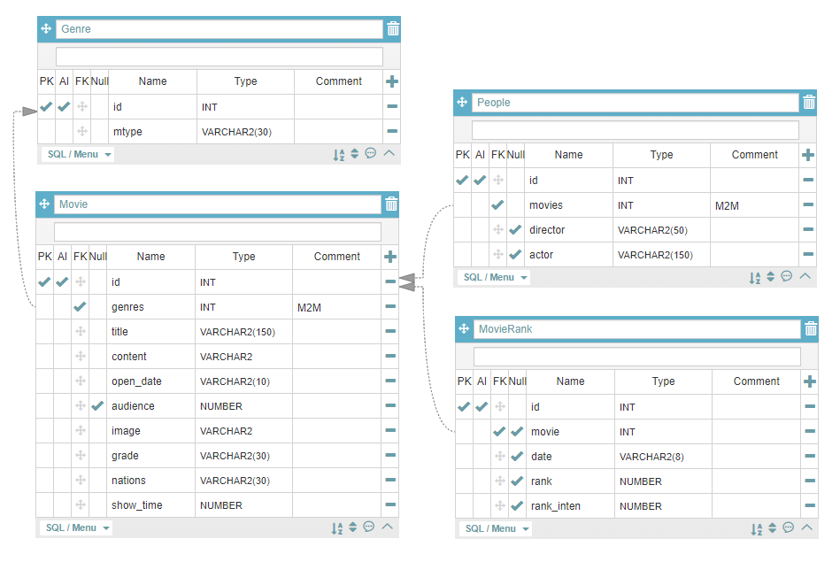

# EndGame

### 개발목적

<hr>

1. 학습
2. 영화정보 제공

<br> 

### 사용기술

<hr>

Language : Python 3.6.7

OS : Linux (C9환경)

Database : SQLite3

Server :

Web : HTML, CSS

Framework : Django 2.1.8

ETC : Bootstrap

<br>

### 사용 라이브러리

<hr>

```bash
# pyenv install
git clone https://github.com/pyenv/pyenv.git ~/.pyenv

echo 'export PYENV_ROOT="$HOME/.pyenv"' >> ~/.bashrc
echo 'export PATH="$PYENV_ROOT/bin:$PATH"' >> ~/.bashrc

echo -e 'if command -v pyenv 1>/dev/null 2>&1; then\n  eval "$(pyenv init -)"\nfi' >> ~/.bashrc

exec "$SHELL"

# python version upgrade
pyenv install 3.6.7
pyenv global 3.6.7
pyenv rehash

# pip upgrade
pip install --upgrade pip

# install django
pip install django==2.1.8

#bootstrap
pip install django-bootstrap4
#ImageField & Resize_Image
pip install Pillow
pip install pilkit
pip install django-imagekit

#oauth
pip install django-allauth
#CORS
pip install django-cors-headers
```

```python
#modles.py
"""
사용법 참조 공식github
https://github.com/matthewwithanm/django-imagekit

cf) 해당 내용은 사용자가 이미지를 업로드할 때 사용하는 Field
"""
from imagekit.models import ProcessedImageField
from imagekit.processors import ResizeToFill
```

<br>

### DataBase

<hr>


**[api연관 Table]**

`Genre`

| DB    | API  | 비고      |
| ----- | ---- | --------- |
| mtype | -    | 장르 종류 |

`Movie`

| DB        | API          | 비고           |
| --------- | ------------ | -------------- |
| genres    | -            | M2M            |
| title     | movieNm      | 영화진흥위원회 |
| content   |              | Naver 정보     |
| open_date | openDt       | 영화진흥위원회 |
| audience  | audiAcc      | null=True      |
| image     |              | Naver 정보     |
| grade     | watchGradeNm | 영화진흥위원회 |
| nations   | nationNm     | 영화진흥위원회 |
| show_time | showTm       | 영화진흥위원회 |

`People`

| DB       | API       | 비고      |
| -------- | --------- | --------- |
| movies   |           | M2M       |
| director | directors | null=True |
| actor    | actors    | null=True |

`MovieRank`

| DB         | API       | 비고           |
| ---------- | --------- | -------------- |
| movie      |           | 1:N            |
| date       | targetDt  | 영화진흥위원회 |
| rank       | rank      | 영화진흥위원회 |
| rank_inten | rankInten | 영화진흥위원회 |

<br>

### 역할

<hr>
**조호근**
-account -> 2019.05.03

​	-​ :heavy_check_mark:자체 회원가입

​	- :heavy_check_mark:Gravatar

-front-end

**정태준**
-all-auth -> 2019.05.04

​	- :heavy_check_mark:Google

​	- :heavy_check_mark:Naver

-데이터 크롤링

​	- :heavy_check_mark:영화진흥위원회API

​	- :heavy_check_mark:네이버(검색)

-MOVIE CRUD

​	- :heavy_check_mark:Create -> admin 크롤링

​	- :heavy_check_mark:Read

​	- :heavy_check_mark:Update -> admin

​	- :heavy_check_mark:Delete -> admin

-COMMENT CRUD

​	- :heavy_check_mark:Create

​	- :heavy_check_mark:Read

​	- Update

​	- Delete

-SCORE CRUD

​	- Create

​	- Read

​	- Update

​	- Delete

-MOVIEDIR CRUD

​	- Create

​	- Read

​	- Update

​	- Delete

<br>

**[추가사항]**

@영화이름 맞추기

@연관 영화 추천

@채팅

@메일링 인증서비스

@내 위치에서 가까운 영화관 추천

@Slack/Telegram 알림